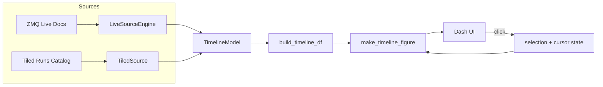
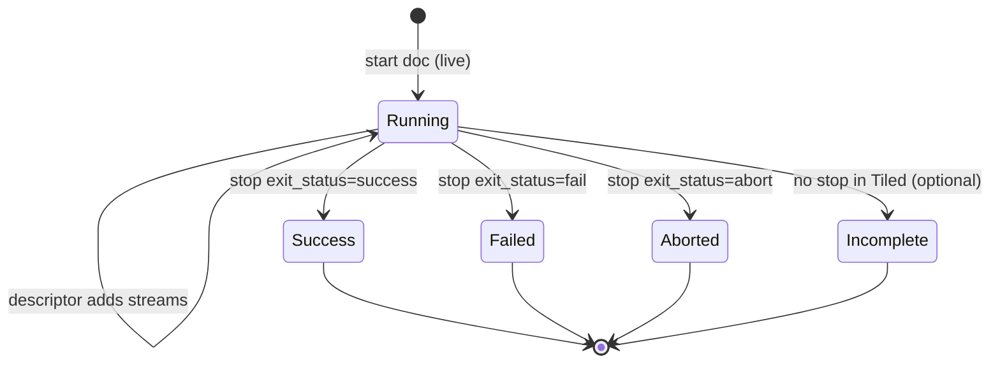

# ARCHITECTURE.md — Bluesky Web Plots Timeline (v1)

This document describes the runtime architecture, key concepts, and design decisions for the **timeline + plot panels** functionality added under `src/bluesky_web_plots/timeline/`.

It complements `design_documentation/CONFIG_SPEC.md`, which defines the configuration contract.

---

## 1. Goals

The system provides an **NLE-style timeline** of Bluesky runs with:

- **Historical context** from a central **Tiled** catalog (durable, canonical after completion).
- **Low-latency updates** from **live Bluesky documents** delivered over **ZMQ** (fast, may be lossy).
- **Selection + playhead (“cursor”)** behavior similar to non-linear editors:
  - Clicking a clip highlights it (selection).
  - A vertical playhead line is placed at the click time and spans all lanes.

The UI shell and plotting infrastructure are provided by the upstream repository’s Dash/Plotly framework; this package adds a **timeline panel** and **Tiled + Live sources**.

---

## 2. Package layout

Key modules (under `src/bluesky_web_plots/timeline/`):

- `config.py` — attrs-based config classes mirroring `CONFIG_SPEC.md`
- `io.py` — `load_config()` JSON loader with strict error messages
- `predicates.py` — predicate AST + evaluation (server/client filtering)
- `models.py` — runtime models (RunEnvelope, TimelineModel, SourceHealth)
- `bootstrap.py` — `create_timeline_model(cfg)` initializes runtime state
- `dataframe.py` — projection: `TimelineModel` + `TrackConfig` → `pandas.DataFrame`
- `figures.py` — timeline Plotly figure builder with selection + playhead overlays
- `tiled_source.py` — server-side time-range query + model updates
- `live_source.py` — document-driven model updates (transport agnostic core)

---

## 3. Core domain model

### 3.1. RunEnvelope

A **RunEnvelope** is the minimal, stable representation needed to draw a clip in the timeline and support selection:

- `uid`: run identifier used throughout the UI (primary key)
- `t_start`: UTC datetime (clip start)
- `t_stop`: UTC datetime or `None` for running/incomplete
- `status`: `running | success | aborted | failed | unknown | incomplete`
- `streams_present`: set of stream names observed (`primary`, `baseline`, …)
- `start_doc` / `stop_doc`: cached start/stop metadata where available
- `updated_at`: last time this envelope was touched (useful for diagnostics)

**Invariant (enforced):** if `status == RUNNING` then `t_stop` must be `None`.

### 3.2. TimelineModel

A **TimelineModel** holds the merged state consumed by the UI:

- `runs`: `dict[uid, RunEnvelope]` — union of known runs from all sources
- `selected_uid`: UID of selected run (clip selection)
- `view`: toggle state (show tiled/live) + time window
- `health_live` / `health_tiled`: `SourceHealth` objects for status badges

### 3.3. SourceHealth (status badges)

For each source (Tiled / Live), `SourceHealth` tracks:

- `connected`: boolean (best-effort)
- `last_update_time`: UTC datetime of last successful update
- `last_error`: last error message (if any)
- `details`: source-specific info (e.g. `zmq_address`, `tiled_uri`)

---

## 4. Data sources and responsibilities

### 4.1. TiledSource (durable, canonical)

`TiledSource` polls a Tiled runs catalog and updates `TimelineModel.runs`.

**Key characteristics**
- Uses **server-side time filtering** to avoid scanning the entire database:
  - Uses `bluesky_tiled_plugins.queries.TimeRange(since, until)` to restrict results.
- Once a run is present in Tiled, it is considered **canonical** (especially for `t_stop` and final `exit_status`).

**Configuration inputs**
- `lookback_hours`: how far back to query runs server-side
- `include_incomplete`: whether to include runs missing a `stop.time`

### 4.2. LiveSourceEngine (low-latency, document-driven)

`LiveSourceEngine` ingests Bluesky documents (from ZMQ or in-process callbacks) and updates `TimelineModel.runs`.

Documents used for timeline state:
- `start`: create a running envelope immediately
- `descriptor`: add stream name to `streams_present`
- `stop`: finalize `t_stop` and status

Other document types (events, datum, resource) are ignored for timeline geometry in v1.

**Late subscription resilience**
- If `descriptor` arrives before `start`, the engine creates a minimal running envelope.
- If `stop` arrives before `start`, the engine creates a completed envelope with best-effort times.

---

## 5. Merge strategy: Live vs Tiled

The system maintains a **unified timeline**. Runs may appear via live docs first, then later become available in Tiled.

**Rule of thumb**
- **Tiled overrides Live** when the same UID appears in both:
  - Tiled provides the durable record (especially `t_stop`, `exit_status`).
- Live provides immediacy for in-progress runs.

**UID policy**
- The run identifier used by the UI is the **Tiled container key** where available.
- The system also records `start.uid` and flags a mismatch (`uid_mismatch`) for diagnostics.
  - Expected: they are identical unless something is wrong.

---

## 6. Rendering pipeline (model → DF → figure)

The system deliberately separates concerns into three layers:

1. **Domain state** (`TimelineModel`) — source-merged state, selection, health
2. **Projection** (`dataframe.py`) — deterministic transformation to a tabular representation
3. **Visualization** (`figures.py`) — Plotly figure building and overlays

This separation is the backbone of maintainability and testability.

### 6.1. Projection: build_timeline_df()

`build_timeline_df(...)` produces a stable DataFrame schema suitable for Plotly and tests.

Key fields include:
- `uid`, `lane`, `t0`, `t1`, `status`, `streams`, `duration_s`
- optional diagnostics: `start_uid`, `uid_mismatch`
- additional fields for hover/debug: `plan_name`, `scan_id`, `proposal_id`, `track_id`, `source`

The projection applies, in order:
- source toggles (`show_sources`)
- track `include_sources`
- time window filtering (`window_hours`)
- stream requirements (`require_streams`)
- predicate filtering (`where`)
- grouping (`group_by` → `lane`)

### 6.2. Visualization: make_timeline_figure()

The timeline figure is built from the DataFrame.

**Numeric lanes decision (important):**
- The figure maps `lane` (string) → `lane_idx` (int) and uses
  - `y="lane_idx"` with y-axis tick labels = lane names.

This makes overlays robust and future-proofs folding/zooming features.

---

## 7. Selection + playhead (“cursor”) behavior

The timeline supports two independent UI concepts:

- **Selection**: a selected run UID (`selected_uid`)
- **Cursor / playhead**: a timestamp (`cursor_time`) drawn as a vertical line across all lanes

### 7.1. Selection highlight

Selection is rendered as a **rectangle overlay** around the selected clip:

- x-range: `[t0, t1]` of the selected run
- y-range: `[lane_idx - 0.4, lane_idx + 0.4]`

This creates an NLE-like “selected clip border”.

### 7.2. Playhead

Playhead is rendered as:
- a vertical line at `cursor_time` spanning all lanes
- an annotation label near the axis with a formatted UTC timestamp

### 7.3. Click behavior (expected)

On click:
- `selected_uid` becomes the clicked clip UID
- `cursor_time` becomes the click x-coordinate (fallback: clip start if x is unavailable)

This is implemented in Dash callbacks (UI layer), not in configuration.

---

## 8. Future enhancements and how current design supports them

### 8.1. Fold/unfold lane groups and vertical zoom

Using numeric lanes makes this significantly simpler:
- Fold/unfold: remap `lane_idx` and update tick labels
- Vertical zoom: adjust `yaxis.range` to focus on a subset

The DataFrame retains the lane name; grouping logic can later emit structured lane paths.

### 8.2. Transport controls (J/K/L)

Recommended approach:
- store playback state in a `dcc.Store`:
  - `cursor_time`, `is_playing`, `playback_rate` (-1/0/+1), `step_s`
- implement a clientside key listener (assets JS) that writes key events to the store
- a periodic interval callback advances `cursor_time` when playing

This is intentionally deferred; the current model already supports it.

### 8.3. Predicate evaluator registry

The current predicate evaluator uses a clear `if/elif` ladder.
A future refactor can switch to an operator registry (dict op → handler) without changing:
- config schema
- projection interface
- figure interface

---

## 9. Testing strategy (TDD)

Where TDD provides strong value:
- Config parsing/validation (`config.py`, `io.py`)
- Predicate parsing/evaluation (`predicates.py`)
- Projection to DataFrame (`dataframe.py`)
- Source logic with fakes (`tiled_source.py`, `live_source.py`)

Where tests should remain light:
- Plotly figure structure (presence of shapes/annotations) — avoid brittle snapshots.

---

## 10. Architecture diagrams

### 10.1. Data flow overview

### 10.2. Timeline clip lifecycle

---

## 11. Operational notes

- For large catalogs, always rely on **server-side queries** in TiledSource.
- Live updates require a ZMQ publisher and may drop messages; Tiled provides eventual consistency.
- The unified timeline defaults to showing both sources; users can toggle visibility.

---

## 12. Glossary

- **Lane**: a row in the timeline. Derived from `group_by` for a given track.
- **Track**: a configured definition (filter + grouping + panel defaults) from config.
- **Clip**: a visual representation of a run (start→stop interval).
- **Selection**: the currently selected clip UID.
- **Playhead/Cursor**: a timestamp used as the “time index” across lanes.
